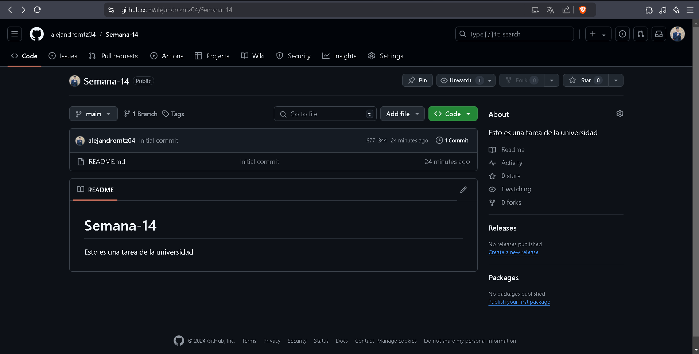

# Semana-14
Esto es una tarea de la universidad

## Temas
* Git

## Materia
Programacion 2

## Nombre
Omar Alejandro Rios Martinez

## Comandos Básicos de Git
Algunos comandos que utilize:

1 **git clone:** Descarga/clona el repositorio
2 **git status:** Muestra el estado del repositorio y muestra los archivos modificados
3 **git Add:** Agrega los cambios a un area de preparacion
4 **git commit:** guarda los cambios actuales del proyecto
5 **git pull:** descarga los cambios mas recientes del repositorio

